# FJSP-AGV
## gurobi
https://github.com/7lldevelopers/FJSP-AGV-gurobi
## 通过大模型来解决当前问题:

https://github.com/7lldevelopers/GLM-AGV/

**\*柔性作业车间生产调度\***

​      在传统的柔性作业车间调度问题研究中，工件在各加工机器间的配送时间和AGV在调度中的路径冲突和路径选择以及有限数量AGV的分配调度常被研究者忽略不计，但这种假设与实际情况不相符合，尤其是依赖多AGV在不同加工机器间时间、距离、多批量的配送下，AGV的运输时间和路径冲突以及订单的分配情况在求解最优调度方案的过程中不容忽视。一方面，改变企业由于制造过程(生产与运输)协同性低导致的生产结构不合理、效率低、能耗大等问题，可以提升企业的核心竞争力，优化车间的制造工艺，减少生产环节的成本消耗，促进企业实现绿色转型；另一方面，生产要素(加工、运输、辅助设备等)的利用直接影响着制造车间生产效益，社会因素(国家政策、社会条件和企业形象等)的存在也会影响着企业生产决策。

​      因此，为了保证各道工序顺畅衔接以及加工机器的工作效率，AGV物流与生产协同调度需基于生产订单计划决策多台AGV 运送订单任务的顺序、规划运输路线、解决碰撞，最终实现最小化订单的最大完成制造时间。

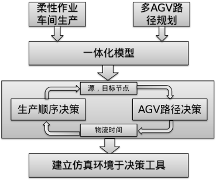

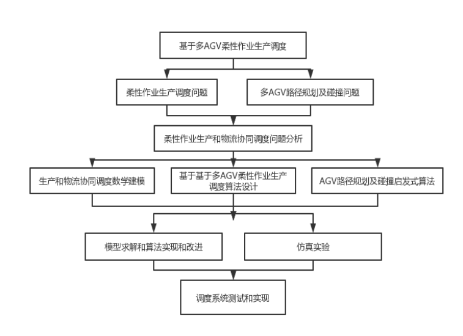

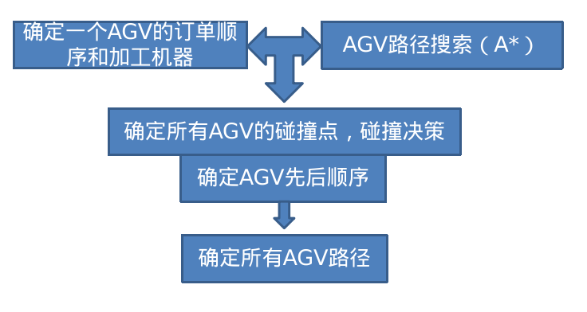

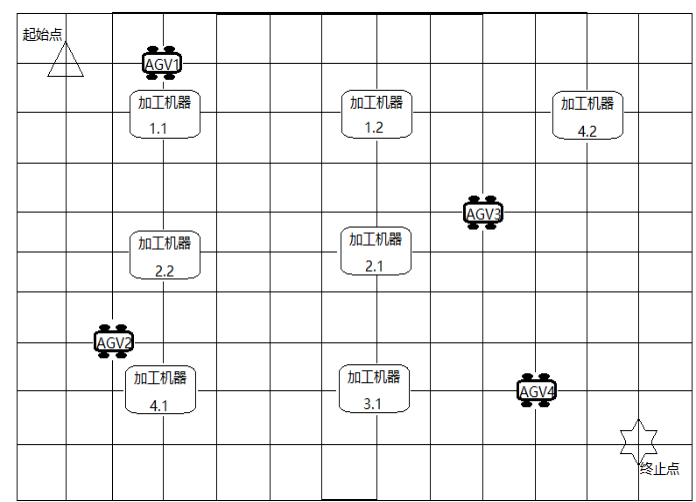

集成AGV调度与生产调度的柔性作业车间问题


## 问题描述:

1.  订单需要在一组机器上面完成一组工件的加工
2. 每个工件的加工包含多道工序
3. 工序之间需满足一定的顺序约束
4. 每道工序只需要一台机器进行加工
5.  工序存在并行的加工机器 
5. 一台机器只能加工一道工序

## 决策变量

 	订单顺序
 	AGV分配到的订单
 	每台机器上工件的加工顺序


## 数据读取

json文件

```
{
  "工件集合": ["001", "002", "003", "004", "005", "006", "007", "008"],
  "位置集合":["01", "02", "03", "04", "05", "06", "07", "08","09", "10","11","12", "13", "14", "15", "16", "17", "18","19", "20", "21", "22", "23", "24", "25"],
  "机器集合": ["M01", "M02", "M03", "M04"],
  "机器的位置": ["03","07","09","21"],
  "AGV集合": ["AGV1", "AGV2", "AGV3"],
  "AGV初始化位置": ["01", "01", "01"],
  "工序": ["A1", "A2", "A3","A4"],
  "工件工序": [
    ["A1", "A2", "A3", "A4"],
    ["A1", "A2", "A3"],
    ["A1", "A3", "A4"],
    ["A1", "A2", "A4"],
    ["A1", "A2", "A3", "A4"],
    [ "A2", "A3", "A4"],
    ["A1", "A2", "A3", "A4"],
    ["A1", "A2", "A3"]
  ],
  "A1":[
    {"机器":"M01","时长":"24"},
    {"机器":"M02","时长":"13"},
    {"机器":"M03","时长":"22"},
    {"机器":"M04","时长":"16"}
  ],
  "A2":[
    {"机器":"M01","时长":"22"},
    {"机器":"M02","时长":"14"},
    {"机器":"M03","时长":"22"},
    {"机器":"M04","时长":"14"}
  ],
  "A3":[
    {"机器":"M01","时长":"21"},
    {"机器":"M02","时长":"24"},
    {"机器":"M03","时长":"12"},
    {"机器":"M04","时长":"11"}
  ],
  "A4":[
    {"机器":"M01","时长":"12"},
    {"机器":"M02","时长":"23"},
    {"机器":"M03","时长":"12"},
    {"机器":"M04","时长":"11"}
  ],

  "工件机器需求阵": [
    ["M04", "M03", "M02", "M01"],
    ["M03", "M04", "M02", "M04"],
    ["M01", "M01", "M03", "M02"],
    ["M03", "M02", "M04", "M01"],
    ["M04", "M02", "M03", "M04"],
    ["M02", "M01", "M03"],
    ["M02", "M03", "M04", "M01"],
    ["M01", "M04", "M02", "M03"]
  ],
  "机器能力集合": [
    [
      {"工件": "001", "工序": 4},
      {"工件": "003", "工序": 1},
      {"工件": "003", "工序": 2},
      {"工件": "004", "工序": 4},
      {"工件": "006", "工序": 2},
      {"工件": "007", "工序": 4},
      {"工件": "008", "工序": 1}
    ],
    [
      {"工件": "001", "工序": 3},
      {"工件": "002", "工序": 3},
      {"工件": "003", "工序": 4},
      {"工件": "004", "工序": 2},
      {"工件": "005", "工序": 2},
      {"工件": "006", "工序": 1},
      {"工件": "007", "工序": 1},
      {"工件": "008", "工序": 3}
    ],
    [
      {"工件": "001", "工序": 2},
      {"工件": "002", "工序": 1},
      {"工件": "003", "工序": 3},
      {"工件": "004", "工序": 1},
      {"工件": "005", "工序": 3},
      {"工件": "006", "工序": 3},
      {"工件": "007", "工序": 2},
      {"工件": "008", "工序": 4}
    ],
    [
      {"工件": "001", "工序": 1},
      {"工件": "002", "工序": 2},
      {"工件": "002", "工序": 4},
      {"工件": "004", "工序": 3},
      {"工件": "005", "工序": 1},
      {"工件": "005", "工序": 4},
      {"工件": "007", "工序": 3},
      {"工件": "008", "工序": 2}
    ]
  ],
  "路径集合": [
    [
      {"路径": "02","路径长度": 1},
      {"路径": "06","路径长度": 1}
    ],
    [
	 ..........
}
```
## 路径
```
-1-1-1-1-1-1-1-1-1-1-1-1-1-1-1-1-1-1-1-1-1-1-1-1-1
-1 1 1 1 1 1 1 1 1 1 1 1 1 1 1 1 1 1 1 1 1 1 1 1-1
-1 A1 1 1 1 1 1 1 1 1 1 1 1 1 1 1 1 1 1 1 1 A2 1 1-1
-1 1 1 1 1 1 1 1 1 1 1 1 1 1 1 1 1 1 1 1 1 1 1 1-1
-1 1 1 1 1 1 1 1 1 1 1 1 1 1 M2 1 1 1 1 1 1 1 1 1-1
-1 1 1 1 1 1 1 1 1 1 1 1 1 1 1 1 1 1 1 1 1 1 1 1-1
-1 1 1 1 M1 1 1 1 1 1 1 1 1 1 1 1 1 1 1 1 1 1 1 1-1
-1 1 1 1 1 1 1 1 1 1 1 1 1 1 1 1 1 1 1 1 1 1 1 1-1
-1 1 1 1 1 1 1 1 1 1 1 1 1 1 1 1 1 1 1 1 1 1 1 1-1
-1 1 1 1 1 1 1 1 1 1 1 1 1 1 1 1 1 1 1 1 1 1 1 1-1
-1 1 1 1 1 1 1 1 1 1 1 1 1 1 1 1 1 1 1 1 1 1 1 1-1
-1 1 1 1 1 1 1 1 1 1 1 1 1 1 1 1 1 1 1 1 1 1 1 1-1
-1 1 1 1 1 1 1 1 1 1 1 1 1 1 1 1 1 1 1 1 1 1 1 1-1
-1 A3 1 1 1 1 1 1 1 1 M3 1 1 1 1 1 1 1 1 1 1 1 1 1-1
-1 1 1 1 1 1 1 1 1 1 1 1 1 1 1 1 1 1 1 1 1 1 1 1-1
-1 1 1 1 1 1 1 1 1 1 1 1 1 1 1 1 1 1 1 1 1 1 1 1-1
-1 1 1 1 1 1 1 1 1 1 1 1 1 1 1 1 1 1 1 1 1 1 1 1-1
-1 1 1 1 1 1 1 1 1 1 1 1 1 1 1 1 M4 1 1 1 1 1 1 1-1
-1 1 1 1 M5 1 1 1 1 1 1 1 1 1 1 1 1 1 1 1 1 1 1 1-1
-1 1 1 1 1 1 1 1 1 1 1 1 1 1 1 1 1 1 1 1 1 1 1 1-1
-1 1 1 1 1 1 1 1 1 1 1 1 1 1 1 1 1 1 1 1 1 1 1 1-1
-1 1 1 1 1 1 1 1 1 1 1 1 1 1 M6 1 1 1 1 1 1 1 1 1-1
-1 1 1 1 1 1 1 1 1 1 1 1 1 1 1 1 1 1 1 1 1 M7 1 1-1
-1-1-1-1-1-1-1-1-1-1-1-1-1-1-1-1-1-1-1-1-1-1-1-1-1```

```
+ -1表示墙
+ A1 A2 A3表示AGV 的初始位置
+ M1到M7表示当前柔性生产车间所处的位置信息
+ 在这里可以将所有的路径点点的之间的距离进行标注（可以不为1 ，可以表示实际的路径长度）
+ 通过A*算法 带入到整体的最大化最小生产时间。
输出结果

.txt

1. 机器的工作时间段
2. AGV工作的时间段
3. AGV的分配订单
4. AGV等待机器的放生位置及等待时间
5. 机器的利用效率
6. AGV运输完订单的最后时间
7. 后续加入路径的时间规划...............

```
M1 0 24 24 46 46 68 68 80 80 102 164 188 210 231 231 253 265 277 
M2 0 14 80 93 93 117 117 141 141 164 164 178 189 202 
M3 27 39 68 80 128 150 188 210 253 265 
M4 0 16 16 27 46 57 57 73 117 128 178 189 
AGV1 0 16 24 46 46 57 68 80 80 93 93 117 117 128 128 150 164 178 178 189 189 202 231 253 253 265 265 277 
AGV2 0 14 16 27 27 39 57 73 80 102 117 141 141 164 164 188 188 210 210 231 
AGV3 0 24 46 68 68 80 
各AGV分配订单情况: AGV0 005003008001 AGV1 006007002 AGV2 004 
冲突发生位置及冲突时间: 位置: M01  AGV冲突等待时间: 8   位置: M04  AGV冲突等待时间: 2   位置: M01  AGV冲突等待时间: 22   位置: M01  AGV冲突等待时间: 11   位置: M04  AGV冲突等待时间: 18   位置: M01  AGV冲突等待时间: 7   位置: M02  AGV冲突等待时间: 15   位置: M02  AGV冲突等待时间: 14   位置: M01  AGV冲突等待时间: 29   
机器的利用效率 MO1 0.65 MO2 0.62 MO2 0.30 MO2 0.40 
times： =277
```

# 算法

## 传统的遗传算法：


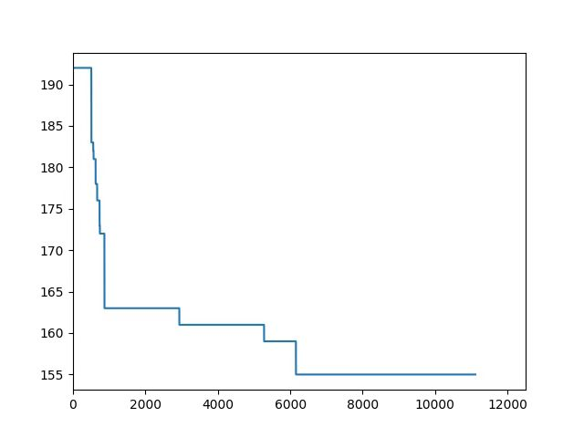

## 量子进化算法 QEA Quantum-Inspired Evolutionary Algorithm

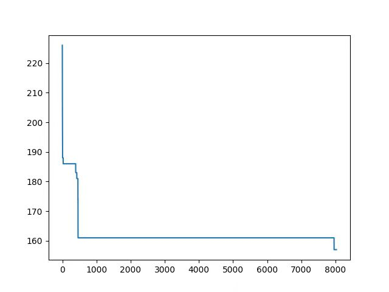

# 实验结果

## AGV调度结果：

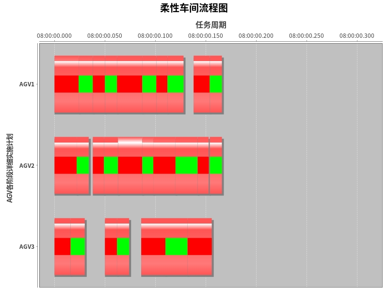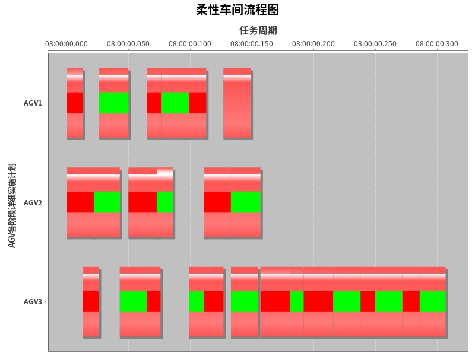

## 最好的结果

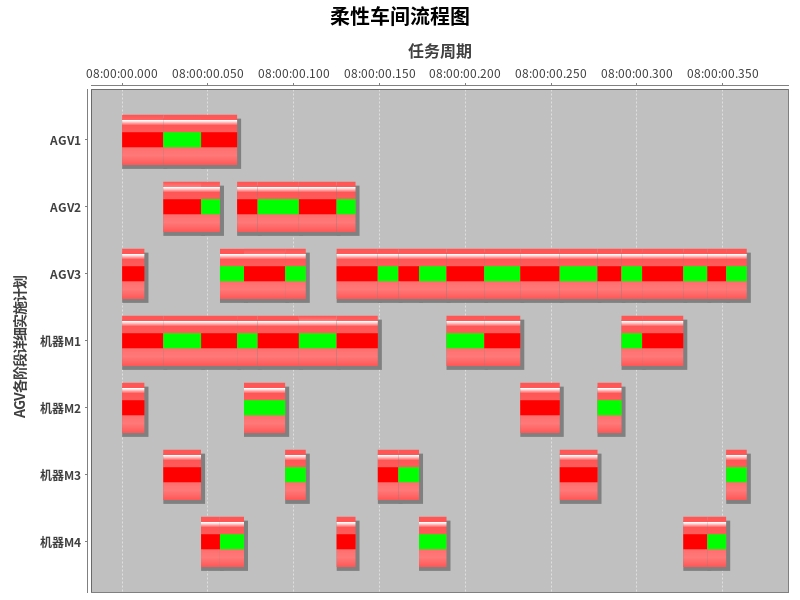


这个包括了机器和AGV的冲突的解决方式

+ QEA算法实现

+ 启发式的先来先服务
+ 带有先提条件的调度策略

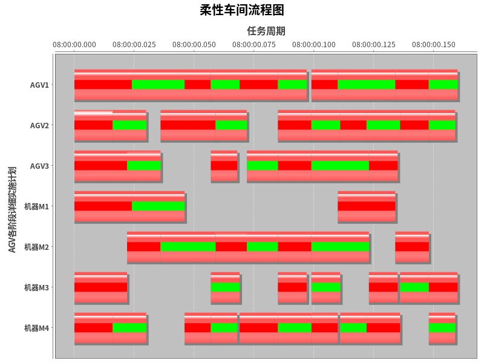

在README.assets 文件夹中 一共出现了10w条调度数据（包括重复的） 搜索到最终的最优值：

+ 8个工件订单（工件的加工顺序不同） 在4不同的工序（在不同的机器加工时间同）  3 个AGV（运输不同）


## openTCS

通过修改openTCS框架，开始模拟执行当前数据。


<<<<<<< HEAD

=======
>>>>>>> b231d36f2678ab3726a00838d8e7a44c9c120510


### 加入路径来最终实现调度模型：

路径为7*7的矩阵。 例如：1357节点。246路径。以此类推。

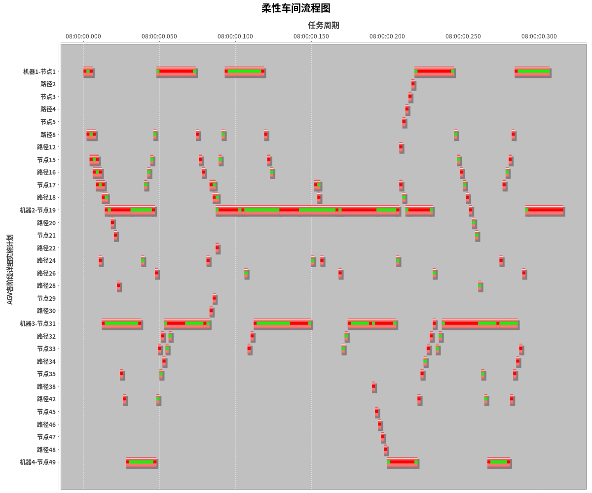

缺点：

+ 由于将所有节点路径变成资源 来管理。后续提供资源来管理。对节点进一步的管理。
+ java并发没有仔细的考虑。（并发炒作后期）。
+ 后续需要统一所有接口。
+ 可以通过现有输出结果，对调度结果进行改良。提升效率。
+ 路径这块也需要改良。
+ QEA算法 效果不是很明显。 遗传效果一般。
